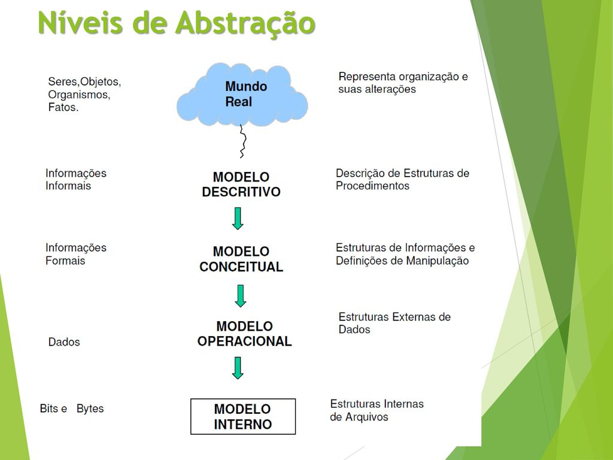
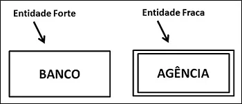
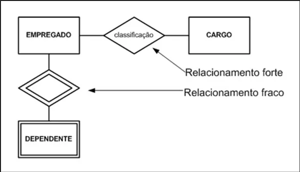
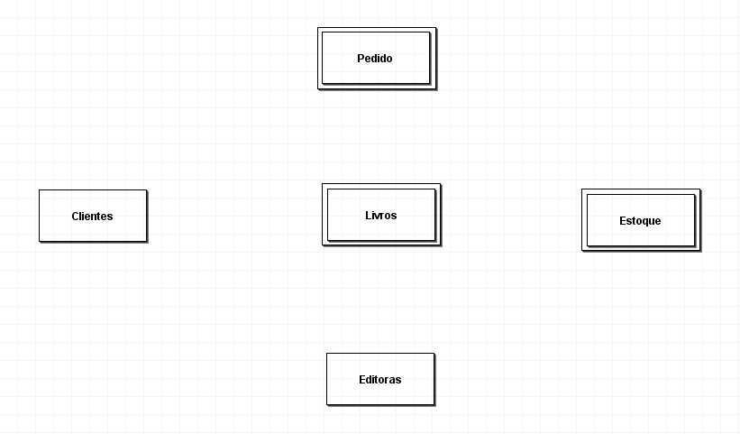
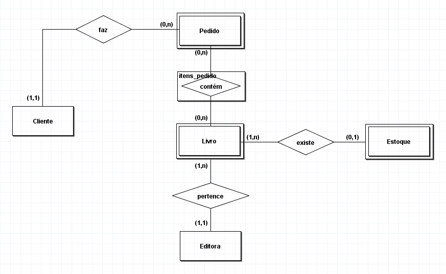
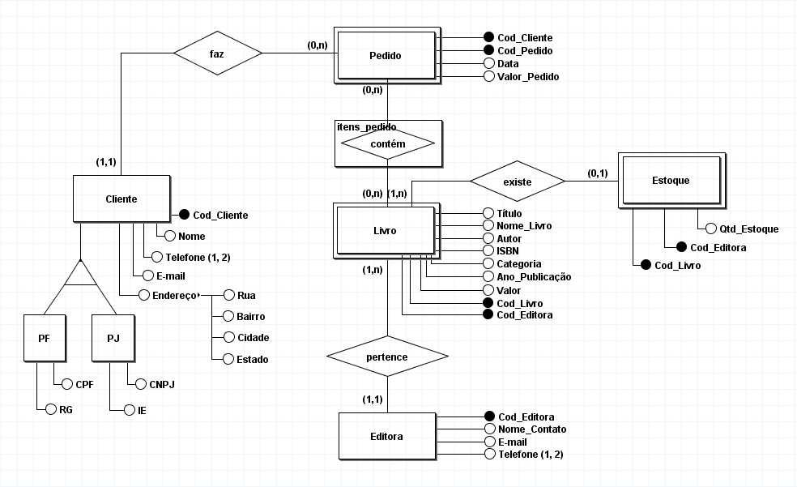

# Modelagem de banco de dados: entidades, relacionamentos e atributos

Identificando modelos de dados (lógico e físico), diferenciando um modelo de alto nível de um modelo de baixo nível, aplicando técnicas de modelagem de dados, diferenciando MER e DER, e elaborando um modelo de dados com brModelo.

1. [Banco de dados](#1-banco-de-dados)
2. [Modelo entidade relacionamento](#2-modelo-entidade-relacionamento)
3. [Entidades](#3-entidades)
4. [Diagrama entidade relacionamento](#4-diagrama-entidade-relacionamento)
5. [Atributos](#5-atributos)

Saiba mais sobre o curso [aqui](https://cursos.alura.com.br/course/modelagem-banco-dados-entidades-relacionamentos-atributos) ou acompanhe minhas anotações abaixo. ⬇️

## 1. Banco de dados

### **Modelagem de dados**

> Modelar significa criar um modelo que explique as características de funcionamento e comportamento de um software a partir do qual ele será criado, facilitando seu entendimento e seu projeto, através das características principais que evitarão erros de programação, projeto e funcionamento. - [Wikipédia](https://pt.wikipedia.org/wiki/Modelagem_de_dados)

**Tipos de modelagem de dados:**

- `Modelagem conceitual:`  
O modelo de dados conceitual ou modelo domínio foca no entendimento dos requisitos do sistema, isto é, no entendimento do negócio. Com uma representação visual, o modelo conceitual utiliza texto, diagrama e símbolos.

- `Modelagem lógica:`  
O modelo de dados lógico descreve como os dados serão armazenados no banco ou sistema, explorando conceitos de entidades, atributos, chaves (primárias e estrangeiras) e dos relacionamentos entre as tabelas.

- `Modelagem física:`  
O modelo de dados físico é diferente do lógico na linguagem utilizada para realizar a representação dos dados. As tabelas, colunas e relacionamentos são feitos a partir da linguagem SQL.

### **SGBD**

SGBD significa `Sistema Gerencial de Banco de Dados` e é o sistema responsável pelo gerenciamento dos bancos de dados de uma empresa, não importando seu tamanho. Ele é utilizado para incluir, alterar ou consultar dados em uma interface, dados que foram previamente armazenados em um banco.

*Alguns SGBD relacionais do mercado:*

- [MySQL](https://www.mysql.com/)
- [PostgreSQL](https://www.postgresql.org/)
- [MariaDB](https://mariadb.org/)
- [SQL Server](https://www.microsoft.com/pt-br/sql-server/sql-server-downloads)
- [Db2](https://www.ibm.com/br-pt/products/db2)
- [SQLite](https://www.sqlite.org/index.html)

**Alto nível e baixo nível**

> Modelo de alto nível está mais próximo da linguagem humana. Já o de baixo nível está mais próximo da linguagem da máquina. O modelo conceitual, por exemplo, é um modelo de alto nível e os modelos físicos são considerados de baixo nível.
>
> Um exemplo de modelo de alto nível conceitual é a representação da estrutura do banco de dados através de formas geométricas. E um exemplo de modelo de baixo nível físico é a criação de um projeto para a estruturação do banco de dados através de comandos que serão interpretados pela máquina.

O `modelo conceitual` é um esquema, um desenho que representa os dados que precisam ser armazenados. Pode ser feito em qualquer programa em que seja possível desenhar tal modelo, como: PowerPoint, Paint, Miro, Figma.

Porém existem softwares específicos para isso, pois eles conseguem converter de um modelo conceitual para um modelo lógico, além de já possuírem os símbolos que são utilizados na criação do modelo, como o `brModelo`.

*Ferramentas de modelagem de dados:*

- [brModelo](http://www.sis4.com/brModelo/)
- [Oracle Designer](https://www.oracle.com/database/technologies/developer-tools/designer.html)
- [PowerDesigner](https://www.sap.com/brazil/products/technology-platform/powerdesigner-data-modeling-tools.html)
- [ERWin](https://www.erwin.com/br-pt/products/erwin-data-modeler/)
- [DB Designer](https://www.dbdesigner.net/)
- [PyDesigner](https://pydesigner.readthedocs.io/en/latest/installation/pydesigner.html)
- [Visio](https://www.microsoft.com/pt-br/microsoft-365/visio/flowchart-software)

## 2. Modelo entidade relacionamento

### **Mini-mundo (recorte do mundo real)**

O mini-mundo é a `descrição textual das regras do negócio`, ou seja, os dados relevantes para o projeto. Conhecido também como levantamento de requisitos. A partir dessas informações é possível criar os primeiros modelos, com as `entidades` e os `relacionamentos`. As entidades podem ser lidas como substantivos e os relacionamentos são poenciais verbos da descrição.

- **O cliente comprou o livro**  
Cliente, autora e livro são as entidades.

- **A autora escreveu o livro**  
Comprar e escrever são os relacionamentos.

A descrição das regras de negócio é feita a partir da entrevista e a `entrevista` é a base para construir um projeto coerente e que atende às necessidades do cliente.

### **Abstração**

A `abstração de dados` se concentra nos aspectos essenciais das regras de negócio. Ignora alguns detalhes em favorecimento da parte importante: ter todos os dados disponíveis ao realizar uma consulta.

> Abstrações de dados são as formas de representar os conceitos implícitos nos requisitos do projeto de banco de dados. Tais requisitos são extraídos do minimundo. Assim, para a modelagem de dados é fundamental o domínio dos construtores semânticos do modelo de dados.

MODELO      | GRAU DE ABSTRAÇÃO   | FOCO                                                | INDEPENDÊNCIA
:---------: | :-----------------: | --------------------------------------------------- | ------------------------
Externo     | Alto                | Visões dos usuários finais                          | Hardware e Software
Conceitual  | Média-Alta          | Visão global dos dados (independe do modelo do BD)  | Hardware e Software
Lógica      | Média-Baixa         | Modelo específico de BD                             | Hardware
Físico      | Baixo               | Métodos de armazenamento e acesso                   | Nem hardware ou software

Quanto maior o grau de abstração, maior o entendimento pelo usuário e maior o nível de detalhes.

### **MER e DER**

> O Modelo Entidade e Relacionamento (MER) e o Diagrama Entidade e Relacionamento (DER) são etapas utilizadas na modelagem de banco de dados. Apesar de terem nomes parecidos, cada um exerce uma função diferente nesse processo.

- `Modelo Entidade Relacionamento:`  
Modelo conceitual dos dados. Descreve textualmente os objetos (entidades) envolvidos, suas caracterísitcas (atributos) e como elas se relacionam entre si (relacionamentos).

- `Diagrama Entidade Relacionamento:`  
Representação gráfica do MER. É a visualização das informações descritas no MER. O diagrama facilita a comunicação, pois oferece uma linguagem comum entre analistas (elabora) e desenvolvedores (implementa).

*Representação gráfica das entidades, atributos, relacionamentos e cardinalidade:*

- `Entidades` são representadas por retângulos
- `Atributos` são representados em lista nas entidades
- `Relacionamentos` são representados por losangos
- `Cardinalidade` é representada por 1 ou n

## 3. Entidades

> Uma entidade é uma representação de um conjunto de informações sobre determinado conceito do sistema. Toda entidade possui atributos, que são as informações que referenciam a entidade.

Numa planilha do Excel, a entidade é o título da coluna e os atributos são as linhas que compõem as informações dessa coluna. Numa coluna em que o título é `Data`, suas linhas terão os `dias e/ou meses` de um ano.

Já o relacionamento está ligado diretamente em como uma coluna está ligada à outra. Então, tendo na mesma planilha a coluna `Produto` e sua linha contém um `objeto que foi vendido`, quer dizer que foi vendido em tal data e aqui está o relacionamento.

### **Entidade forte vs Entidade fraca**

> Uma entidade forte sempre tem a chave primária no conjunto de atributos que descreve a entidade forte. A entidade fraca não possui a chave primária, mas tem uma chave parcial que discrimina de maneira única as entidades fracas.

- Entidades fortes existem independentemente de outra entidade.
- Entidades fracas dependem da existência de outra entidade.

Entidades fortes são representadas por um retângulo simples, enquanto entidades fracas são representadas por retângulos duplos.

O mesmo acontece com os relacionamentos. Relacionamentos fortes são representados por um losango simples, enquanto relacionamentos fracos são representados por losangos duplos.

### **Entidades no DER**

A partir da análise realizada na entrevista e elaborada na descrição do mini-mundo, no documento **[Entrevista clube do livro](Entrevista%20clube%20do%20livro.docx)**, é possível identificar e definir as seguintes entidades:

- [x] Clientes
- [x] Livros
- [x] Editoras
- [x] Pedido
- [x] Estoque

Foi identificado que `livros`, `pedido` e `estoque` são entidades fracas, pois dependem que um cliente realize uma compra e que uma editora forneça o livro. Sendo, então, `clientes` e `editoras` as entidades fortes.

## 4. Diagrama entidade relacionamento

### **Relacionamentos**

Os `relacionamentos` são referências de uma entidade em outra, representados no DER através de losangos. Para fazer a referência, os relacionamentos precisam verificar a `cardinalidade`, que é a forma como as entidades se conectam, ou seja, como elas se relacionam.

> O relacionamento entre entidades é formado a partir de uma associação entre duas ou mais entidades. Essa associação é criada usando instruções de junção para recuperar dados.
>
> Existem três tipos de grau de relacionamento: O grau `binário`, ocorre quando o relacionamento acontece entre duas entidades. O `ternário` é o relacionamento entre três entidades e o `N-ário` entre quatro ou mais entidades ao mesmo tempo.

A `cardinalidade` expressa o comportamento da entidade a uma ocorrência em outra entidade. Esse comportamento é o número de ocorrências em que uma entidade se relaciona com outra. Existem dois tipos de cardinalidade.

A `cardinalidade mínima` ocorre quando há um número mínimo (1,1) de relacionamento entre as entidades.  
A `cardinalidade máxima` occore quando há muitos (0,N) relacionamentos entre as entidades.

*Tipos de cardinalidade:*

Cardinalidade | Relacionamento                    | Exemplo
:-----------: | --------------------------------- | ----------------------------
1:1           | Relacionamento Um-Para-Um         | 1 cliente possui 1 registro
1:N           | Relacionamento Um-Para-Muitos     | 1 cliente possui N pedidos
N:N           | Relacionamento Muitos-Para-Muitos | N clientes compram N livros

### **Entidades associativas**

Entidades associativas estão relacionadas à cardinalidade `muitos-para-muitos`. Ela ocorre quando um relacionamento é entendido como uma entidade. No exemplo do clube do livro existe uma entidade associativa que está relacionada a quantidade de itens num pedido, sendo que estes itens são muitos livros.

> Uma entidade associativa é um termo usado na teoria relacional e de entidade-relacionamento. Um banco de dados relacional requer a implementação de uma relação base para resolver relacionamentos muitos-para-muitos. Uma relação base que representa este tipo de entidade é chamada, informalmente, de "tabela associativa". - [Wikipédia](https://pt.wikipedia.org/wiki/Entidade_associativa)

*A entidade associativa é representada por um losango dentro de um retângulo:*

## 5. Atributos

Os atributos são as propriedades das entidades, suas características e identificadores. Eles podem ser simples, compostos, multivalorados, derivados e/ou atributos chave.

- `Simples` não pode ser dividido em partes menores para formar outros atributos
- `Compostos` pode ser subdividido em partes menores, como o endereço, por exemplo
- `Multivalorados` pode ter muitos valores associados a ele, como o número de telefone
- `Derivados` depende de outro atributo para existir ou, até mesmo, de uma entidade
- `Chave` é um identificador único, um registro distinto de uma entidade ou atributo

Os atributos podem ser representados por chaves. Os atributos únicos, ou seja, que não se repetem na mesma tabela e não podem ser nulos, são chamados de `chaves primárias` e recebem uma identificação personalizada no diagrama.

### **Chave estrangeira**

Entidades fracas recebem a chave primária da entidade forte relacionada a ela, o que compõe a `chave parcial`. Contudo, a entidade fraca pode conter atributos próprios. Sendo assim, pode receber uma `chave estrangeira`.

Um bom exemplo disso, no clube do livro, é a relação entre a entidade cliente e a entidade pedido. Em que, não existe pedido sem cliente e quando um cliente faz um pedido, este é realizado no nome dele.

Portanto, na entidade cliente deve existir uma chave primária com o `código do cliente`. Na entidade pedido deve existir uma chave primária com o `código do pedido` e, também, uma chave estrangeira com o `código do cliente`.

O modelo elaborado no curso pode ser acessado baixando o arquivo **[modelagem_conceitual](modelagem_conceitual.brM3)**.

⬆️ [Voltar ao topo](#modelagem-de-banco-de-dados-entidades-relacionamentos-e-atributos) ⬆️
